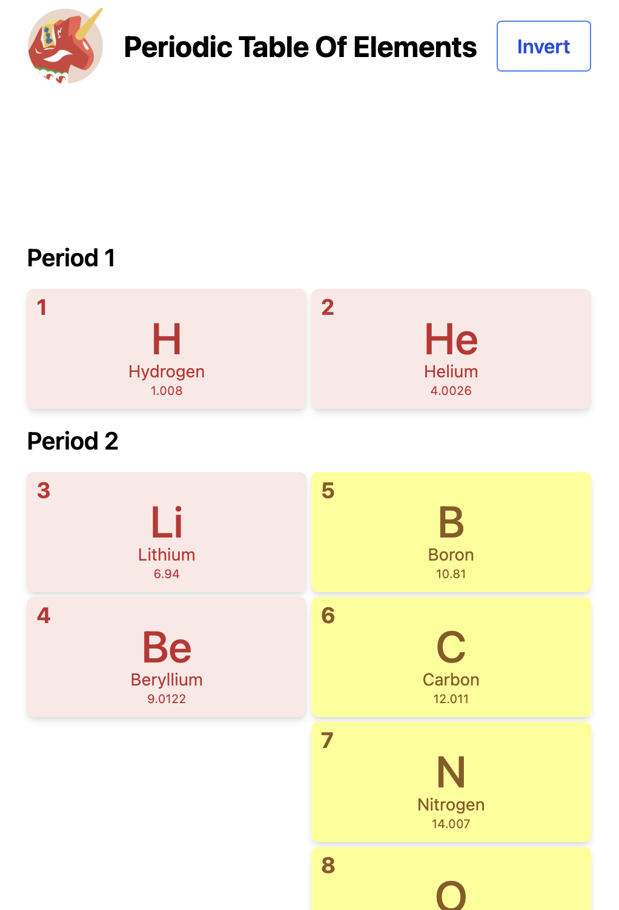
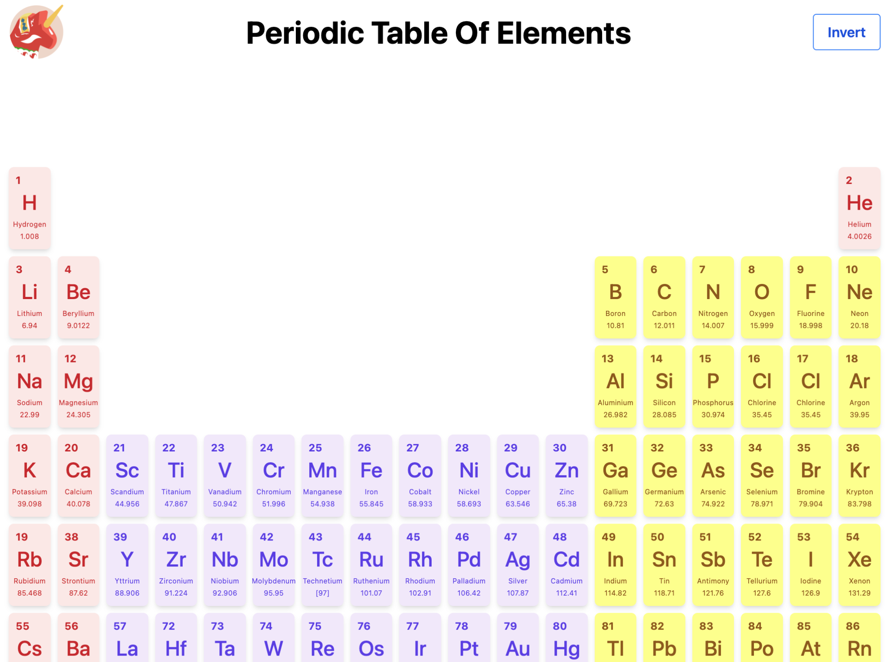
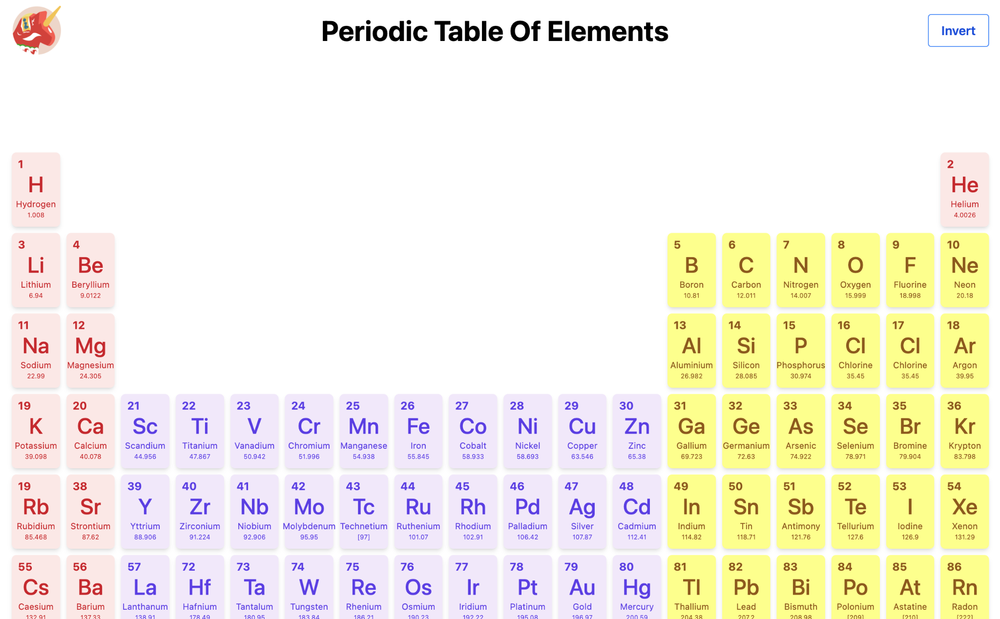

Betao Periodic Table Project
============================

Welcome to the Betao Periodic Table Project! This application provides a dynamic and interactive exploration of the periodic table, designed to offer both educational insights and an engaging user experience for chemistry enthusiasts and professionals alike.

## Mobile View


## Tablet View


## Desktop View


🚀 Getting Started
------------------

These instructions will get you a copy of the project up and running on your local machine for development and testing purposes.

### Prerequisites

Ensure you have the following tools installed and running on your system:

*   [Node.js](https://nodejs.org/) (v16.x or later)
*   A modern code editor like Visual Studio Code
*   [Git](https://git-scm.com/) for version control

### Installation

Follow these simple steps to get your development environment running:

1.  **Clone the repository**
    
    bashCopy code
    
    `git clone [repository_url]`
    
2.  **Navigate to the project directory**
    
    bashCopy code
    
    `cd periodic-table-betao`
    
3.  **Install dependencies**
    
    bashCopy code
    
    `npm install`

🌐 Deployed Project Link
-------------------

Experience the Periodic Table Project in action by visiting the [live version here](https://periodic-table-betao.netlify.app/).

📖 Project Overview
-------------------

The project is structured to facilitate easy development and expansion. Here's what you need to know to dive in:

### Development Steps
(- POC - Design - Development - Test - Depoloyment)

1.  **Familiarize with the Project**
    
    *   Start by reading through the project documentation.
    *   Analyze the `periodic-table-data.json` to understand the dataset.
2.  **Design and Prototyping**
    
    *   Explore design references like our [Figma UI template](https://www.figma.com/file/kH7LTf6kzVhwtk1SICCApj/Periodic-Table-(Community)).
    *   Establish a Style Guide based on the chosen design.
3.  **Development Workflow**
    
    *   Break down the project into manageable tasks.
    *   Utilize React components and TailwindCSS for UI development.
4.  **Testing and Quality Assurance**
    
    *   Write unit and integration tests using Jest and React Testing Library.
    *   Ensure code quality with ESLint.
5.  **Deployment**
    
    *   Outline a deployment strategy for hosting the application.

👨‍💻 For Developers
--------------------

### Running the Application

*   **Development Mode**
    
    bashCopy code
    
    `npm run dev`
    
*   **Build for Production**
    
    bashCopy code
    
    `npm run build`
    
*   **Run Tests**
    
    bashCopy code
    
    `npm run test`
    

📚 Documentation
----------------

*   **Component Documentation**: Find detailed documentation on components and utilities in the `docs` folder.

## Folder Structure

The project adopts the Atomic Design Methodology for organizing components, ensuring scalability and maintainability. Here's an overview of the project's directory structure:

```plaintext
root/
├── public/                    # Public files like the favicon and index.html
├── src/                       # Source files for the application
│   ├── __tests__/             # Unit and integration tests
│   ├── assets/                # Static files such as images and icons
│   ├── components/            # Organism level components
│   ├── data/                  # Data files, including periodic-table-data.json
│   ├── designsystem/          # Design system components (atoms and molecules)
│   │   ├── atoms/             # Atom level components
│   │   │   ├── buttons/       # Button components like ButtonOuline ...
│   │   │   ├── elements/      # Element components like ElementFilled, Input, Select ...
│   │   │   └── typography/    # Typography components (e.g., headings, text)
│   │   └── molecules/         # Molecule level components
│   │       ├── FirstRow.tsx   # Component for the first row of the periodic table
│   │       ├── SecondRow.tsx  # Component for the second row, and so on...
│   │       ├── ...            # Other row components until SeventhRow.tsx
│   │       ├── LanthanidesRow.tsx # Lanthanides row component
│   │       └── ActinidesRow.tsx   # Actinides row component
│   ├── hooks/                 # Custom React hooks
│   ├── types/                 # TypeScript type definitions
│   │   └── periodic-table.ts  # Type definitions for periodic table data
│   ├── utils/                 # Utility functions
│   ├── App.css                # Main CSS file for the application
│   ├── App.tsx                # Main application component
│   ├── index.css              # Global styles
│   └── main.tsx               # Entry point for the application
├── test/                      # Additional tests
├── .eslintrc.cjs              # ESLint configuration
├── index.html                 # HTML entry point
├── jest.config.ts             # Jest configuration for testing
├── package-lock.json          # Locked versions of the package dependencies
├── package.json               # Project metadata and dependencies
├── postcss.config.js          # PostCSS configuration for processing CSS
├── tailwind.config.ts         # Tailwind CSS configuration
├── tsconfig.json              # TypeScript compiler configuration
└── vite.config.ts             # Vite configuration for the build and dev server
```

### Key Directories and Files:

- **public/**: Contains the public assets that can be accessed by the index.html file.
- **src/**: The heart of the application, containing all the source code, components, and logic.
    - **__tests__/**: Houses all test files, ensuring our components and utilities work as expected.
    - **assets/**: Static assets such as images and global stylesheets.
    - **components/**: Organism-level components that compose molecules into functional sections or complete interfaces.
    - **data/**: Data files used across the application, including the periodic table data.
    - **designsystem/**: Contains atomic and molecular components, following the principles of Atomic Design.
        - **atoms/**: The smallest functional elements of the UI, such as buttons and text fields.
        - **molecules/**: Combinations of atoms that work together to perform a function.
- **hooks/**: Custom React hooks for shared logic across components.
- **types/**: TypeScript definitions to ensure type safety across the application.
- **utils/**: Utility functions that provide common functionality.

This structure is designed to foster a clear and efficient development process, adhering to best practices in component organization and scalability.

🤝 Contributing
---------------

We welcome contributions! Please read our [Contribution Guidelines](CONTRIBUTING.md) for more information on how to report issues, contribute code, and improve documentation.

📄 License
----------

This project is licensed under the MIT License - see the [LICENSE](LICENSE) file for details.